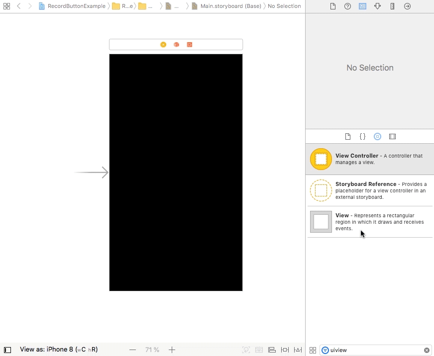

## RecordButtonView


[](https://github.com/pablogsIO/RecordButton)
[](https://github.com/pablogsIO/RecordButton)

A simple iOS record button writing in Swift

<p align="center">
    
</p>


## Requirements

- Swift 4. Should work with Swift 3

## Example Project

You have a fully functional demo in Example folder

## Usage

### Interface Builder

- Drag RecordButton class into your project
- In your storyboard, select a UIView
- Go the the identity inspector and in the class field, type RecordButton instead of UIView

<p align="center">
    
</p>


### Manually

- Drag RecordButton class into your project
- In your ViewController add the following

```swift
    var recordButton: RecordButton?
    override func viewDidAppear(_ animated: Bool) {

        super.viewDidAppear(animated)

        let recordButtonSide = self.view.bounds.size.height/10
        recordButton = RecordButton(frame: CGRect(x: self.view.bounds.width/2-recordButtonSide/2,
                                                  y: self.view.bounds.height/2-recordButtonSide/2,
                                                  width: recordButtonSide,
                                                  height: recordButtonSide))
        recordButton?.delegate = self

        self.view.addSubview(recordButton!)

    }
```
### Delegate

The ViewController should adopt RecordButtonDelegate protocol to control when the button is pressed

```swift
extension ViewController: RecordButtonDelegate {

    func tapButton(isRecording: Bool) {

        if isRecording {
            print("Start recording")
        } else {
            print("Stop recording")
        }
    }
}

```


## Support/Issues
If you have any questions, please don't hesitate to create an issue.

## ToDo
* Add Cocoapods

## License
RecordButton is available under the MIT license. See the LICENSE file for more info.

If you use it, i'll be happy to know about it.
